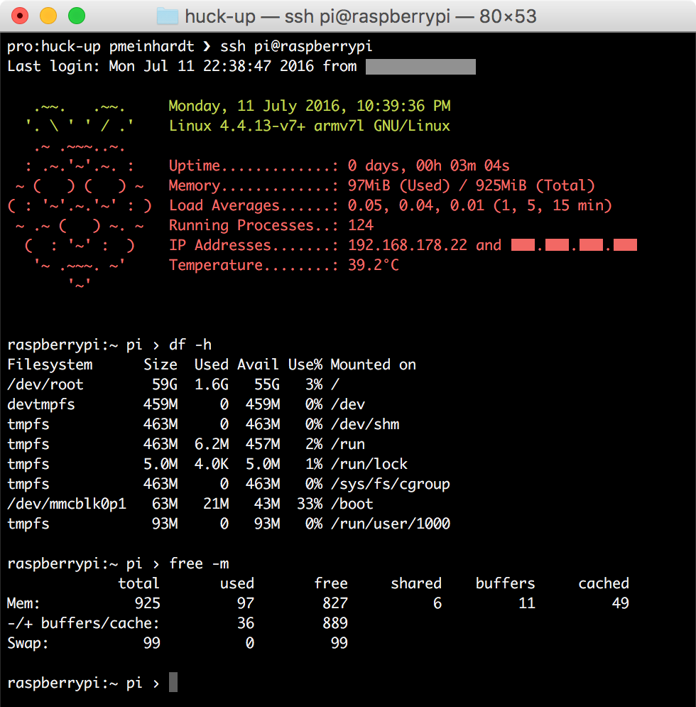

# Huckleberry - Welcome home

My personal Raspberry Pi (home server) management.

Built using [Ansible](https://github.com/ansible/ansible).



## Preparations

There are a few things which you'll need to prepare. Here we go:

1. **Get your Pi up.** Huck-up automates server management using Ansible.
   Its playbooks are written with Raspbian/Debian systems in mind. If you don't
   have a Raspberry Pi operating system on an SD card yet, download
   [Raspbian](https://www.raspberrypi.org/downloads/raspbian/) and
   [install](https://www.raspberrypi.org/documentation/installation/installing-images/)
   it. Push the card into your Pi and power it up.

2. **Connect your Pi.** Your Raspberry Pi needs to be connected to your local
   network. Just hook it up to your router with an ethernet cable if you have
   one, or else configure
   [WiFi](https://www.raspberrypi.org/documentation/configuration/wireless/).

3. **Install Ansible.** On your local machine, install
   [Ansible](http://docs.ansible.com/ansible/intro_installation.html).
   Alternatively you can also run the huck-up playbook directly on your Pi.

4. **Clone this repo…**
   `git clone https://github.com/pmeinhardt/huck-up.git && cd huck-up`

## Provisioning

**Now it is time you adapt the service and deployment configuration to your
needs.**

We recommend you keep these versioned in your own fork of this repository.

- Right away, you'll want to edit `site.yml` to your liking
  and select the roles you need.

- Create a file named `vars/private.yml` and hack away. Values in `private.yml`
  take precedence over anything defined in `default.yml`. If you're fine with
  the defaults, just `touch vars/private.yml` and you're done.

- You may want to encrypt your `private.yml` using Ansible Vault if you plan on
  keeping it in your repository. A brief description is presented in a separate
  section below.

**Be sure not to commit passwords into public repos!**

If you have made changes to your Pi already - in particular if it is available
under a different hostname - update the `raspberrypi` inventory file or create
a private copy that you pass to Ansible via the `-i/--inventory-file` option.

You can verify your Pi is reachable by running
`ansible -i raspberrypi -a "/bin/hostname" raspberrypi`.

**To bootstrap your Pi, run:**

```shell
./script/bootstrap # if you have not changed the default username or password
ansible-playbook -i raspberrypi -u USERNAME -k site.yml # otherwise
```

or, if running [locally](http://docs.ansible.com/ansible/playbooks_delegation.html#local-playbooks) on your Pi:

```shell
# change the "hosts:" entry in site.yml to "hosts: 127.0.0.1", then run:
ansible-playbook site.yml --connection=local
```

This will get everything set up and you're good to go.

You might have to reboot your Pi for some changes to take effect,
e.g. the HiFiBerry device tree setup.

**You can rerun these commands from time to time
in order to keep your Pi up-to-date.**

A handy script to do that for you is available. Just run `./script/update`.

## Encrypting configuration files

If you keep application secrets in your configuration files, you can use
[Ansible Vault](http://docs.ansible.com/ansible/playbooks_vault.html) to
encrypt them.

When you override the default variables for a deployment for instance,
encrypt the variables file as follows:

```
ansible-vault encrypt vars/config.yml
```

This will prompt for a password and save the file as encrypted data.
When running a playbook containing Vault-encrypted files append
`--ask-vault-pass`, i.e. run:

```
ansible-playbook -i raspberrypi site.yml -e "@vars/config.yml" --ask-vault-pass
```

## Creating backups

To come.
